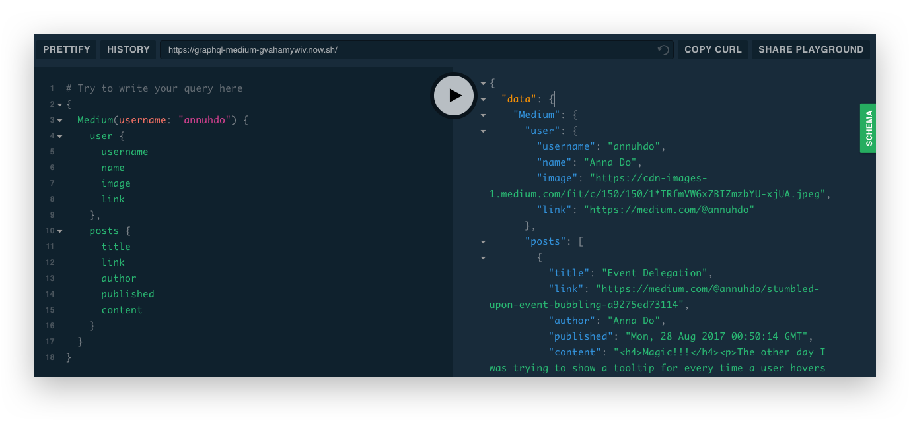

# medium-feed-graphql 🚀

A GraphQL wrapper for a user's Medium feed. [Hosted Deployment ▲](https://graphql-medium-gvahamywiv.now.sh/)


## Features

* Able to grab `user` and his or her latest `posts`.
* Utilizes GraphQL with a single endpoint.
* Data grabbed from
  [Medium's RSS Feed](https://help.medium.com/hc/en-us/articles/214874118-RSS-feeds).
  
## Query
```
query {
  Medium(username: "annuhdo") {
    user {
      username
      name
      image
      link
    },
    posts {
      title
      link
      author
      published
      content
    }
  }
}
```

## Installation

### Initial setup

```
$ git clone https://github.com/annuhdo/graphql-medium.git
$ cd graphql-medium

$ yarn install
```

### Start server locally

Server is going to be hosted on port 7778. This can be changed on
[server.js](./server.js).

```
$ yarn start

🚀 Server is running on port: 7778
```

## License

MIT -- I made this for my personal website but you may use this for whatever you
would like! 😀
